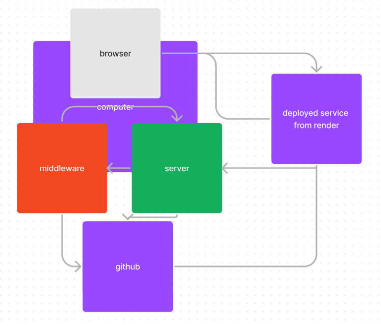

# LAB - 01 server-deployment-practice

## Author: Mike Pace, Sara Russert

tests report (actions)<https://github.com/catdude2000/server-deployment-practice/actions>  
front-end (render deploy)<https://server-deployment-practice-prod-oxae.onrender.com/>

## Setup

### .env requirements

PORT - 3000

### Running the app

npm start

Endpoint: /  
Returns Object  
{"error":404,"route":"/","message":"no data on this route"}  

Endpoint: /hello  
Returns Object  
hello! Sat Jul 01 2023 23:38:05 GMT+0000 (Coordinated Universal Time)  

Endpoint: /goodbye  
Returns Object  
goodbye  

Tests  
npm test  

UML  
(Created with Figma)  
  

<https://github.com/catdude2000/server-deployment-practice/pull/5>
